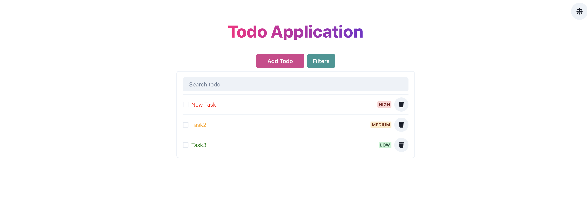

# React and Django Todo Project using chakra-ui

This project is an implementation of a Todo application using Django Rest Framework as the backend and React for the frontend. The React app (`todo-app`) is set up alongside Django applications to create a full-stack web application that manages todo lists.

## Features

- **CRUD Operations**: Create, Read, Update, and Delete Todos.
- **Searching**: Searching based on todos title .
- **Filtering**: Filter todos based on priority, completeness and due date.
- **API Endpoints**
    - /api/todos/
- **Real-Time Updates**: Utilizes efficient communication between the frontend and backend to ensure state is synchronized across all clients.
- **Github Actions**: Testing workflows for both backend and front end are being handled.
- **Containerization**: Application is dockerized and docker-compose i being used for both django and react containers. 

## Demo

Here you can include a GIF or a set of screenshots demonstrating the application's functionality:



## Local Setup Guidelines

1. Clone the repository:
   ```bash
   git clone https://github.com/zeeshan-amir/to-do-app.git
   cd to-do-app
   ```

2. Set up a virtual environment:
   ```bash
   python -m venv venv
   source venv/bin/activate  # On Windows use `venv\Scripts\activate`
   ```

3. Navigate to the React application directory:
   ```bash
   cd todo-app
   ```

4. Add the environment file:
   ```bash
   touch .env
   Add the VITE_APP_BASE_URL= 'http://localhost:8000' in env for development env
   ```

5. Navigate back to the root:
   ```bash
   cd..
   ```

6. Install dependencies & run the app:
   ```bash
   docker-compose up --build
   ```

## Test Cases

Test cases for both django and react are added and ran before the build.

## Conclusion

This README provides all necessary information to get the project set up locally, run tests, and understand the API.
Collapse
